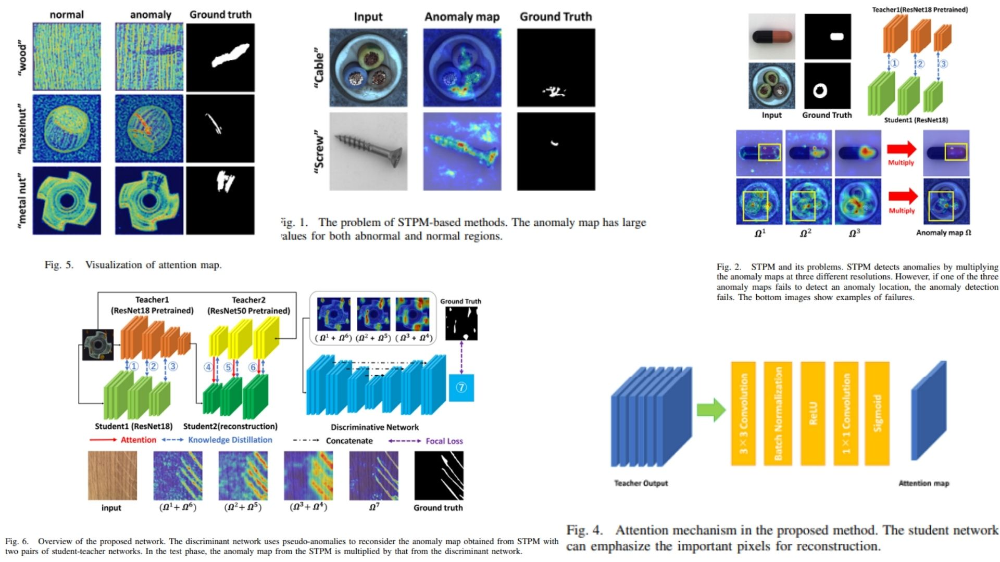

# 📝 RST-AD-Replication — Reconstructed Student-Teacher for Anomaly Detection

This repository provides a **faithful Python replication** of the **RST-AD framework** for pixel-level anomaly detection.  
The goal is to **reproduce the model, math, and block diagram from the paper** without performing full training.

Highlights:

* **Pixel-wise anomaly detection** via dual student-teacher reconstruction and discriminative nets 🌌  
* Two students: one for **STPM-style feature matching**, another for **attention-guided reconstruction** 🎯  
* Discriminative network refines anomaly maps to improve localization ✨  
* Anomaly maps $$A$$ and image-level scores $$\max(A)$$ 📈  

Paper reference: *[Reconstructed Student-Teacher and Discriminative Networks for Anomaly Detection](https://arxiv.org/abs/2210.07548)*  

---

## Overview 🖼️



> The pipeline uses **two student-teacher pairs**:  
> 1️⃣ STPM-style student learns **feature similarity** with teacher  
> 2️⃣ Reconstruction-style student uses **attention-guided decoder**  
> The **discriminative net** refines pixel-level anomaly predictions.

Key points:

* **Teacher1 (T1)**: pretrained ResNet18, guides Student1 (STPM) 🌿  
* **Teacher2 (T2)**: pretrained ResNet50, guides Student2 (reconstruction) 🌟  
* **Student1**: encoder-only feature matching network  
* **Student2**: encoder + attention + decoder for reconstruction  
* **Discriminative net**: U-Net style, inputs pseudo-anomalies, outputs refined anomaly map  
* **Anomaly map** $$A$$: high values indicate deviations  
* **Image-level score**: $$\max(A)$$

---

## Core Math 🧮

**Cosine similarity loss** between teacher and student features:

$$
L_\text{cos} = 1 - \frac{\langle F_l^t, F_l^s \rangle}{\|F_l^t\|_2 \cdot \|F_l^s\|_2}
$$

**Pixel reconstruction loss** (L1):

$$
L_\text{pixel} = \| I - \hat{I} \|_1
$$

**Segmentation loss** (focal + L1):

$$
L_\text{seg} = - \alpha (1-p)^\gamma \log(p) + \|M - \hat{M}\|_1
$$

> Total loss: combination of $$L_\text{cos}$$, $$L_\text{pixel}$$, and $$L_\text{seg}$$

---

## Why RST-AD Matters 🌟

* Learns **anomalies without labeled defects** 🏭  
* Two complementary students capture both **feature differences** and **attention-guided reconstruction** 🛠️  
* **Discriminative net** refines predictions for higher precision 🎯  
* Modular: backbone, teacher, student, attention, and discriminative nets are all replaceable 🔧  

---

## Repository Structure 🏗️

```bash
RST-AD-Replication/
├── src/
│   ├── backbone/
│   │   ├── teacher_resnet.py        # Teacher1: ResNet18, Teacher2: ResNet50
│   │   └── student_encoder.py       # Student1/2 encoders (ResNet18)
│   │
│   ├── layers/
│   │   ├── decoder_block.py         # Student decoder blocks (upsample + residual)
│   │   ├── attention.py             # Attention from Teacher to Student
│   │   ├── similarity.py            # Cosine similarity / normalized feature difference (Eq.2-3)
│   │   └── anomaly_synthesis.py     # Pseudo-anomaly generation (DRAEM style)
│   │
│   ├── modules/
│   │   ├── student1_model.py        # STPM-style student (encoder only + decoder)
│   │   ├── student2_model.py        # Reconstruction-style student (encoder + decoder + attention)
│   │   ├── discriminative_net.py    # U-Net style, refines anomaly maps
│   │   └── feature_pipeline.py      # Multi-resolution features: F_l^t, F_l^s
│   │
│   ├── losses/
│   │   └── losses.py                # L_cos, L_pixel, L_seg
│   │
│   ├── model/
│   │   └── rst_ad_model.py          # Full pipeline: Teacher1+Student1 + Teacher2+Student2 + Discriminative net
│   │
│   └── config.py                     # hyperparameters, Focal loss gamma, decoder settings
│
├── images/
│   └── figmix.jpg                    
│
├── requirements.txt
└── README.md
```

---

## 🔗 Feedback

For questions or feedback, contact:  
[barkin.adiguzel@gmail.com](mailto:barkin.adiguzel@gmail.com)
